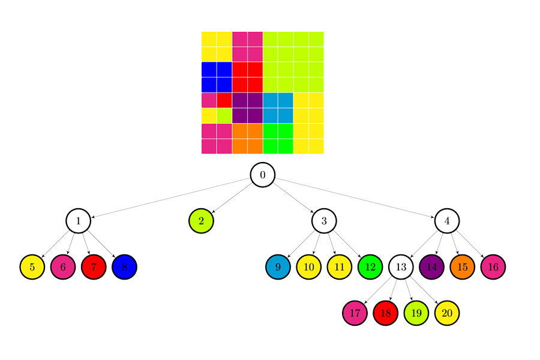

# Quadtree Compression
A simple program that uses quadtrees to compress, decompress and mirror images.



# Build
Use the included Makefile
```
make
```

# Usage

```
./quadtree -m <flip_mode> <compression_level> <input_image> <output_image>
```
## Compressing an image
```
./quadtree -c 200 input_image.ppm binary.out
```
 

## Decompress an image

```
./quadtree -d <binary_input> <output_image>
```

## Flip an image

```
./quadtree -m <mode> 0 <input_image> <output_image>
```
### Horizontal
```
./quadtree -m h 0 image.ppm horizontal.ppm
```


### Vertical
```
./quadtree -m v 0 image.ppm vertical.ppm
```


## Completion Date
2018, April 20
